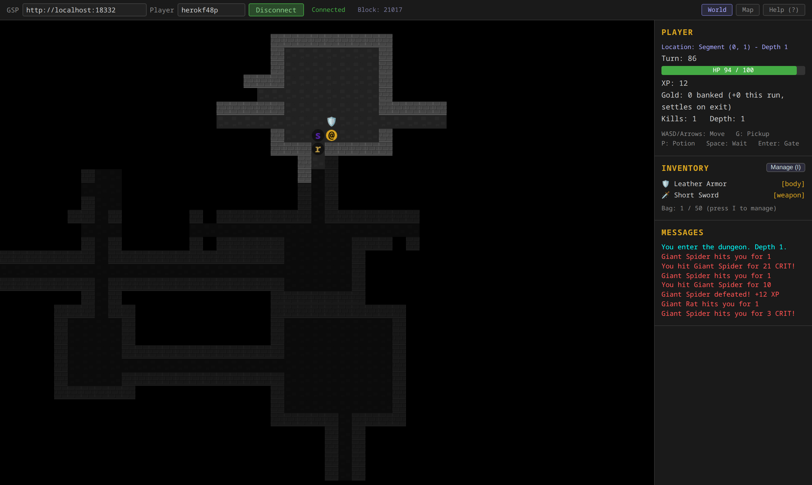

# Xaya Roguelike Frontend

Browser-based frontend for the [Xaya Roguelike](https://github.com/EdwardAThomson/xaya-roguelike) blockchain game. Connects to the GSP via JSON-RPC, displays the overworld segment map, and runs dungeon sessions locally with on-chain settlement via action replay proofs.

> **This repo** is the TypeScript browser client. The C++ backend (on-chain Game State Processor) lives in the companion repo: **[xaya-roguelike](https://github.com/EdwardAThomson/xaya-roguelike)**. The two must stay in lockstep on the deterministic dungeon/combat code (byte-for-byte parity).



*Delving a Depth-1 dungeon: fog-of-war exploration, monsters, ground loot, and a live combat log, with on-chain player stats settling on exit.*

**Zero runtime dependencies** -- pure TypeScript compiled with `tsc`, no npm packages in production. All rendering is Canvas 2D with procedural sprites.

## Features

- **Overworld map**: Segment graph rendered on canvas, click to select; drag to pan, scroll to zoom, Recenter (C) to snap back to your segment
- **On-chain state**: Player stats, inventory, equipment, combat record from the GSP
- **Dungeon play**: Full turn-based roguelike (12 monster types, 31 items, fog of war, 8-dir movement)
- **In-dungeon map**: Fog-of-war-aware minimap of the current dungeon (the Map view's "Dungeon" tab, alongside the "World" segment graph)
- **Character sheet**: Tabbed in-game panel (Inventory, Character, Players, Co-op, Help) with base and effective stats, XP progress, and mid-run equip of banked gear
- **Crash-safe runs**: In-progress dungeon runs persist locally and deterministically resume on reload, and explored maps (fog of war) survive reloads too; server-side timeouts and death knock-backs auto-recover
- **Multiplayer presence**: Other players shown as tokens on the overworld map and listed (active first) in a Players tab
- **Two-player co-op**: Co-op is local: you meet a partner by walking into the same confirmed segment through your own gates. Step onto a gate and pick "wait here for a partner" or "join" someone already waiting, or use the Co-op tab, which lists only the runs reachable from where you stand. Each player spawns at the gate they came in through, then you play one shared dungeon in rounds of one action each; your partner is drawn in the dungeon and on the minimap, kill rewards split by damage dealt, and the run settles on-chain by mutual consent (`sc` confirm + `s` settle). Checkpoint confirms go out during the run, so if a partner vanishes the sidebar offers **Continue alone from their checkpoint** once their last checkpoint is old enough, and the survivor finishes solo and settles with `solo_from`
- **Player-vs-player duels**: The same gate that opens a co-op run can open a **duel** instead: stake gold (or nothing), and the challenger who walks in from their own side matches it. Each round is commit / reveal / apply, so neither side can see the other's choice before making their own, and the round's RNG is reseeded from both revealed salts. You attack by bumping into your opponent, the arena shows both HP bars and the round phase, and walking out through a gate is a concession, not an escape: the last one standing takes the pot and banks XP for it
- **Account picker**: On a hosted deploy, Play opens a character chooser listing the characters this browser has already claimed, plus a "new character" form that registers on-chain; local dev keeps the name + Connect controls in the topbar
- **Channel integration**: Enter dungeons using real on-chain player stats, exit with cryptographic replay proof
- **Deterministic**: Dungeon generation and RNG verified identical to C++ backend (SHA-256 + MT19937)

## Quick start

```bash
# Install dev dependencies (TypeScript, plus Playwright for the e2e suite)
npm install

# Compile
npx tsc

# Compile and run the automated checks: the cross-language parity vectors
# (pinned against the backend's tests, co-op and duel included) plus the
# co-op and duel runner convergence tests
npm test

# Serve (sends no-store, so a reload always picks up the latest build)
python3 serve.py 8000
# Open http://localhost:8000
```

`python3 -m http.server 8000` works too, but it sends no cache headers, so the
browser can keep serving a stale `dist/` module graph after a rebuild.

### Standalone mode

Open the page, click **Play** on the title screen, then press N to start a local dungeon session. No backend needed.

### Connected mode (devnet)

```bash
# Terminal 1: Start the backend devnet
source ~/Explore/xayax/.venv/bin/activate
cd ~/Projects/xayaroguelike
python3 devnet/frontend_devnet.py

# Terminal 2: Serve frontend
cd ~/Projects/xaya-roguelike-frontend
python3 serve.py 8000
```

1. Open `http://localhost:8000` and click **Play** on the title screen
2. Paste the GSP RPC URL from terminal 1 into the GSP field
3. Enter a player name, click **Connect**
4. Click **Register Player** if the name is new
5. Click a direction button to **Discover** new segments
6. Click a segment, then **Enter Dungeon** (to travel between segments, walk to a gate inside a dungeon and step through)
7. Play the dungeon, then click **Submit Results On-Chain**

### Co-op (two browsers)

Connect two different player names to the same devnet. Co-op is **local**: you
meet by walking into the same **confirmed** segment (not the hub) through your
own gates, so both players have to be standing next to it first.

1. Player A steps onto the gate leading to that segment and picks **Wait here for a partner** from the gate choices (equivalently: open the game modal's **Co-op** tab and click **Wait at the *dir* gate**, which lists every run reachable from where you stand). The Co-op tab then shows the open run with a **Cancel run** button
2. Player B walks to their own gate into the same segment and picks **Join *A*'s run**, at the gate or from the Co-op tab (**Leave run** backs out again)
3. The run starts automatically once the visit is full; both clients play the same dungeon in rounds of one action per player, each spawning at the gate they walked in through, with the partner drawn in teal
4. When the run is over, settlement is automatic: the other player sends an `sc` confirm of the merged action log, and participant 0 (first in canonical name order, not necessarily the host) sends the `s` settle once that confirm is on chain
5. During the run each client also sends periodic `sc` checkpoint confirms (every `COOP_CHECKPOINT_ACTIONS` applied actions, and at least every `COOP_HEARTBEAT_MS` as a heartbeat). The sidebar shows the partner's last checkpoint and its age; once it is `ABANDON_WINDOW_BLOCKS` old, **Continue alone from their checkpoint** rebuilds the run at that checkpoint, marks the partner absent, and lets the survivor play out and settle solo (`s` with `solo_from`). All three constants live in `src/config.ts`

`npm run coop` drives this flow end to end in two headless browsers (see `tests/e2e/README.md`).

### Duels (two browsers)

A duel is hosted from the same gate dialog as a co-op run, and reaches the same
segment, so both players still have to be standing next to it first.

1. Player A steps onto the gate and picks **Wait here for a duel**, then a stake
   from the presets (0, 10, 25, 50, 100 gold, filtered to what they hold). The
   stake leaves the purse immediately and sits in escrow
2. Player B walks to their own gate into that segment and sees the mode and the
   stake before joining; a stake they cannot cover is shown as a disabled choice
   saying what they hold, rather than a move the chain would reject
3. Each round runs commit → reveal → apply: the player chooses once, at the
   commit step, and the client emits the reveal and then the sealed action as the
   opponent's messages arrive. The round is reseeded from both revealed salts,
   so neither side can bias it. A player who stalls is carried by a fixed tick
   that runs from the round opening
4. Bump into your opponent to attack. Stepping onto a gate warns that Enter is a
   forfeit, and the confirm spells out the cost: the opponent wins on the spot
   and takes the pot, and you take the ordinary death outcome with your finds lost
5. Settlement is the co-op path with a duel claim: survival means *won*, the
   winner's gold includes the pot less the rake (`DUEL_RAKE_PERCENT`, 0 today)
   and their XP includes `DUEL_XP_BASE` (20) per level of the loser. Both
   constants in `src/game/settle.ts` mirror the GSP's `moveprocessor.hpp`; if
   they drift, every duel claim is rejected

Before hosting or joining anything, the client compares its rules and banking
versions against the GSP's (`version` on the state snapshot). A **rules**
mismatch blocks hosting and joining, because such a run is only rejected at
settlement, after it has been played in full; a **banking** mismatch warns once
and carries on, since only the projected rewards would be wrong.

`npm run duel` drives a full two-browser duel through the real UI, and
`npm run duel:evil` runs the adversarial suite: two Node actors holding their own
copy of the engine fight honestly, then take turns trying to steal the result
over the real move path (see `tests/e2e/README.md`).

## Project structure

```
index.html                  Single-page app (canvas + sidebar)
style.css                   Dark theme, monospace layout
tsconfig.json               TypeScript config (strict, ES2020)
serve.py                    Static server that disables browser caching
src/
  main.ts                   Entry point, dual-mode app (overworld / dungeon)
  config.ts                 GSP URL, proxy URL, constants
  game/
    dungeon.ts              Procedural dungeon generation (80x40 grid)
    session.ts              Turn-based dungeon session engine (N participants; solo is participant 0), plus duel mode (commit/reveal/apply rounds)
    settle.ts               Multiplayer settlement: canonical action lines, consent hash, pool split, claims (co-op and duel), compact proof encoding
    parity_test.ts          Cross-language parity vectors pinned against the backend (`npm test`)
    hash_test.ts            SHA-256 test vectors (`runHashTests()` from the browser console)
    combat.ts               Attack/defense/crit/dodge math, player-vs-monster and player-vs-player
    monsters.ts             12 monster templates scaled by depth
    items.ts                31 item definitions (weapons, armor, potions)
    overworld.ts            Segment graph layout (BFS from origin)
    input.ts                Keyboard handler (WASD/arrows/hotkeys)
    rng.ts                  MT19937 (matches C++ std::mt19937)
    hash.ts                 SHA-256 (matches C++ HashSeed())
  render/
    canvas.ts               Canvas setup and main render loop
    tiles.ts                Procedural wall/floor/gate sprites (24px)
    entities.ts             Monster symbols, item icons, player
    camera.ts               Viewport management
    fov.ts                  Fog of war (8-tile radius LOS)
    overworld.ts            Segment map canvas renderer
    dungeonmap.ts           Dungeon-layout minimap (Map view "Dungeon" tab)
  net/
    rpc.ts                  JSON-RPC 2.0 client (typed GSP methods)
    connection.ts           Connection manager with auto-polling
    moves.ts                Move submission client (devnet proxy)
    walletTransport.ts      Wallet (window.ethereum) move transport, dormant until Phase F4b
    validator.ts            Client-side pre-validation (mirrors moveparser.cpp)
    pending.ts              Post-submit watcher: applied / rejected / pending, counted in blocks
    coop.ts                 Co-op runtime: relay transport (devnet proxy) + runner that merges both players' actions; duel mode rides the same path, with commit and reveal modelled as action types
    coop_test.ts            Two-runner convergence test over an in-memory relay (`npm test`)
    duel_test.ts            Two-client duel convergence test, each with its own secret salt (`npm test`)
  ui/
    modal.ts                Error/confirm dialogs
    overlay.ts              Overlay rendering
tests/e2e/                  Headless Playwright harness + soak bots (see tests/e2e/README.md)
dist/                       Compiled JS + source maps
```

## Architecture

```
Browser
  |
  |-- JSON-RPC ----------> rogueliked (GSP)     reads state
  |                          on port from devnet
  |
  |-- HTTP POST ---------> move_proxy           submits moves
       (devnet only)         on port 18380
       |
       v
    XayaAccounts contract on Anvil (local EVM)
```

On a hosted deploy the two endpoints are same-origin instead: `/gsp` relays the
read-only GSP calls and `/proxy` carries moves, both behind a TLS reverse proxy,
so the GSP RPC port is never public and there is no mixed-content or CORS
problem. `src/config.ts` picks the defaults from the origin (localhost and
`file://` get the fixed devnet ports), and `?gsp=` / `?proxy=` query params
override them for test harnesses.

In connected mode the move proxy also carries the co-op message relay
(`relay_send` / `relay_recv`): each client sends only its own dungeon actions,
and `net/coop.ts` applies them on both sides in the engine's turn order so the
two clients converge on one merged action log.

**Overworld mode**: Fetches player info, segments, and visits from the GSP. Renders the segment graph centered on the player's current position. Sidebar shows stats, inventory, and action buttons (discover, enter dungeon, and a compact co-op status line with a shortcut into the Co-op tab, which is the lobby).

**Dungeon mode**: Runs a `DungeonSession` locally. In channel mode, uses the real segment seed and player stats from the GSP. On exit, submits the action replay proof on-chain for verification; with `COMPACT_ACTIONS` on (the default) every settlement move (`xc`, the `gw` settlement, `s`) sends the proof as the GSP's compact string encoding (`settle.ts` `encodeCompactLog`, about a quarter of the JSON array's calldata) rather than the JSON array. In co-op the same session runs with two participants, each spawned at the gate they walked in through, and the merged log is settled by mutual consent (`sc` confirm, then `s` settle from participant 0); if a partner goes stale the survivor can continue alone from their last checkpoint and settle with `solo_from`. A duel visit builds the same session in duel mode (the mode is read from the visit row, never from local state), which turns each round into commit/reveal/apply with a per-round reseed from both salts, and settles with an explicit won/lost claim.

## Determinism

All game-critical algorithms are verified to produce identical output in TypeScript and C++:

| Algorithm | TS file | C++ file | Verified |
|-----------|---------|----------|----------|
| SHA-256 | `game/hash.ts` | `hash.hpp` | byte-for-byte |
| MT19937 RNG | `game/rng.ts` | `std::mt19937` | output sequence |
| Dungeon gen | `game/dungeon.ts` | `dungeon.cpp` | 3200/3200 tiles |
| Co-op session + settlement | `game/session.ts`, `game/settle.ts` | `dungeongame.cpp`, `moveprocessor.cpp` | pinned 2-player vectors incl. absent partner and compact proof form (`npm test`) |
| Duels | `game/session.ts`, `game/combat.ts`, `game/settle.ts` | `dungeongame.cpp`, `combat.cpp`, `moveprocessor.cpp` | pinned duel vectors: fought out, concession, stall, commitment preimage, settle hash (`npm test`) |

This ensures the browser can generate dungeons and record action logs that the GSP will accept during on-chain verification.

## Security

- **Zero npm runtime deps**: No supply chain attack surface in production
- **No wallet keys in code**: Signing via `window.ethereum` (MetaMask) in production
- **Local dungeon play**: No private data leaves the browser during gameplay
- **Replay proofs**: Full action log submitted (in the compact string encoding) for on-chain deterministic verification
- **Readable source**: Players can inspect the TypeScript source for trust

## What's next

- **Phase F4b**: MetaMask wallet integration (replace devnet move proxy)
- **Phase F6**: Sprite image assets, animations, sound effects

See [PLAN.md](PLAN.md) for the full development plan.
